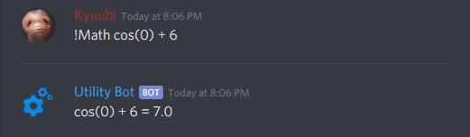
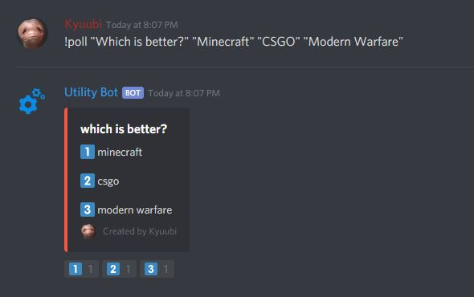

# Discord Utility Bot
A discord bot that can start polls and do math

# Here is how it works
In a discord text channel you can type !math (a math problem) and the bot will solve it!
  

You can also create polls by typing !poll "question" "vote A" "vote B" "vote C" etc... and people in your discord server can vote!

